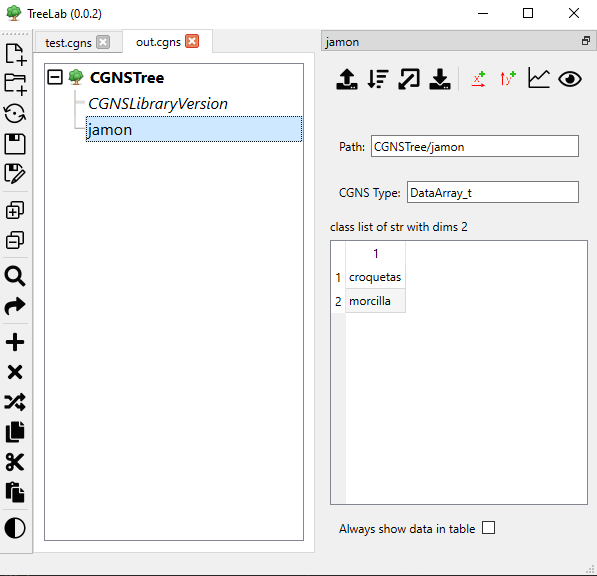

[TreeLab](https://github.com/Luispain/treelab) is part of [MOLA](https://github.com/onera/MOLA) software, fully sharing its license and rights. 

Installation
============

From sources
------------

Use [git clone](https://docs.github.com/en/repositories/creating-and-managing-repositories/cloning-a-repository) command in order to download the source files:
```
git clone https://github.com/Luispain/TreeLab
```

From a working Python environment, you can compile using [pypi](https://packaging.python.org/en/latest/tutorials/installing-packages/). For example, a user-only installation would
be done as follows:

```
python3 -m pip --user install .
```

* You may use `--user` option on order to install only for current user. 
* You can use `--prefix` option to specify the directory where the installation will be done
* You can use `-e` option to install in developer mode; such that any change in `*.py` source files will be immediately take effect

If you do not have admin rights and you encounter problems using `--prefix`, then
try force reinstalling all dependencies:

```
python3 -m pip install --force-reinstall --no-cache-dir --ignore-installed --prefix=/your/path/to/treelab/installation mola-treelab
```


From stable releases
--------------------

PyPi
----

```
python3 -m pip --user install mola-treelab
```

Make sure that the installation `bin` directory is seen by your `PATH` environment variable. For exemple, in Linux:
```bash
export PATH=$PATH:~/.local/bin
```

Usage
=====

You may use the API of TreeLab using a python script :

```python
from treelab import cgns
n = cgns.Node( Name='jamon', Value=['croquetas', 'morcilla'])
n.save('out.cgns', verbose=True)
```

From command line, you can launch the GUI using `treelab` command, optionnaly followed by the absolute or relative path of the CGNS file to open and optionally using the `-s` option in order to load only the skeleton of the tree, for example:
```
treelab out.cgns
```



